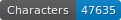
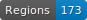
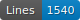
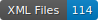

# FoNDUE - FR - MSS - 19

   

This repo contains the transcription of 17th c. French manuscripts.

## Content

| Town  | Author  | Library                          | Shelfmark                                                          | Folios   | Date | Transcription               |
|-------|---------|----------------------------------|--------------------------------------------------------------------|----------|------|-----------------------------|
| Genève | Zola   | Fondation Bodmer                 | [Z-6.3*](https://bodmerlab.unige.ch/fr/constellations/autographes/barcode/1072068758) | 99        | 1893 | P. Jacsont |
| Saint-Denis (La Réunion) | - | Archives départementales de La Réunion | IE5                                             | 15      | 1814 | L. Chappuis |

## How to cite

Cf. [`htr-united.yml`](https://github.com/FoNDUE-HTR/FONDUE-FR-MSS-19/blob/main/htr-united.yml) file.

## Licences
Annotation is CC-BY. Images belong to the digital libraries.

 